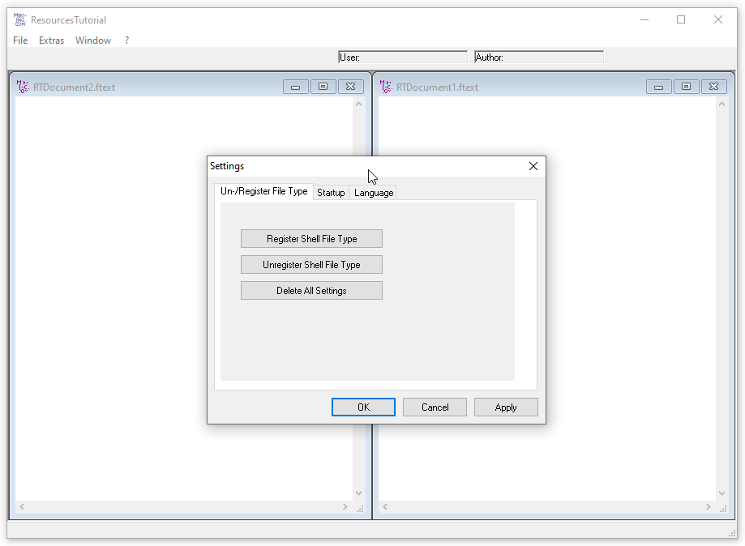

# ResourcesTut
## Tutorial on how to use resources and when  
* rc.exe and rcDll.dll 
  localize or copy from the directory:
  - either from Windows-SDK 
    C:\Programs\Windows Kits\10\bin\10.0.17763.0\x86\
    (if ar sometime happens to be there is a x64-VB then from the X64-directory)
    (C:\Programs\Windows Kits\10\bin\10.0.17763.0\x64\)
  - or from VB
    C:\Programs\Visual Studio\VB98\Wizards\

* MyRes.rc 
  edit the Ressources-script file

* MyRes.h 
  in the header-file all constants are defined

* MakeRes.exe (MakeRes.bat) 
  - if your project is in UNC-path (on a server-drive) start the exe
    (you can find MakeRes [here](https://github.com/OlimilO1402/MakeRes))
  - if your project is in local drive (or mounted) you may also start the bat-file

Attention possible bugs: 
 - path starting with a T or t.
 -> solution: use double-backslash 
 -> reason:   "/t" has any other meaning

* using manifest.exe.manifest
  in Windows 7 edit the manifest-file and put your program-name.
  Use the following lines of code anywhere in a module:
  
  Public Declare Sub InitCommonControls Lib "comctl32.dll" () 
  Private Sub Form_Initialize()
      Call InitCommonControls
  End Sub

* The example-app is a complete MDI-Application
  MDI means Multiple-Document-Interface. 
  you can learn how to:
  
  - make your app international with different languages
    let the user decide which language is desired
	
  - use files in resources
    > the app has always default proper language-files
	> copy the file from resource to disk
	> let the user edit the language file, and send it back to you
    
  - register your own file-type icon
    connect it with you app and make it double-clickable
    by using function RegisterShellFileTypes
	
  - manage settings: create, edit and delete
    
  - manage inprogram-icons for menues or toolbars
    
  - menu window
    properly manage child-windows 
  
